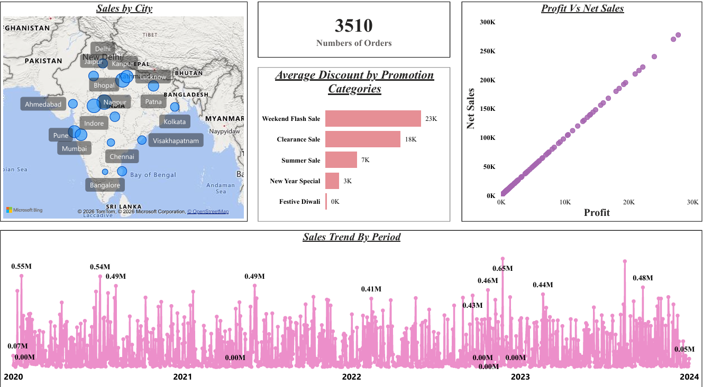
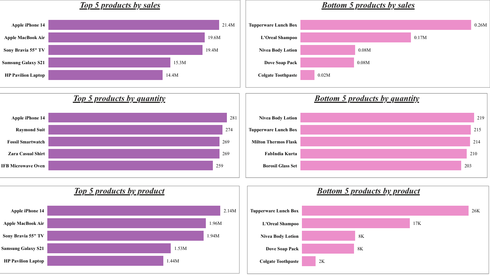
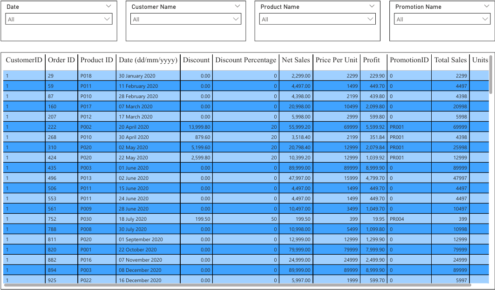
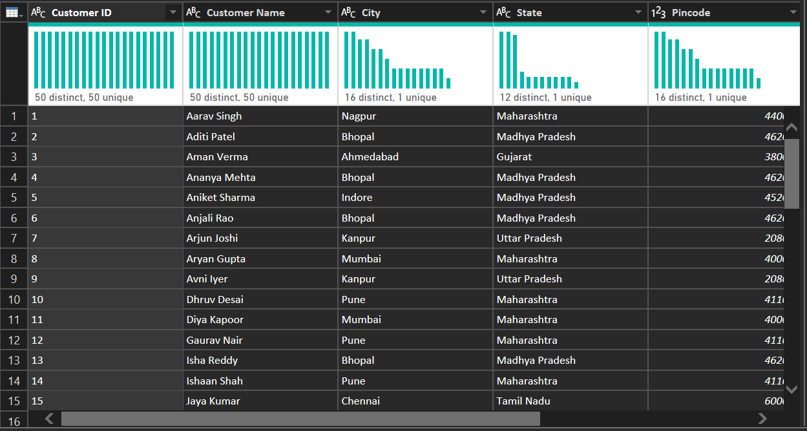

# 📊 Sales Performance Dashboard (Power BI)

## 🔍 Overview

This project is an interactive Power BI dashboard analyzing sales, profit, and product performance across different regions and time periods.

## 🎯 Objective

To identify business insights such as top-performing products, sales trends, and profitability.

## ⚙️ Tools Used

* Power BI
* Excel Dataset

## 📈 Key Features

* Top & Bottom 5 products by sales, quantity, and profit
* Sales trend analysis (2020–2024)
* City-wise sales distribution (Map)
* Profit vs Net Sales analysis
* Interactive filters (Date, Product, Customer)

## 📸 Dashboard Preview

## 🧹 Cleaned Data Preview

## 📌 Insights

* High-performing products contribute most to revenue
* Some products have high sales but low profit
* Sales vary significantly over time
* Promotions impact discount trends

## 🚀 Conclusion

This dashboard helps in making data-driven business decisions by analyzing sales performance and product trends.

## 👩‍💻 Author

Ananya Singhal
